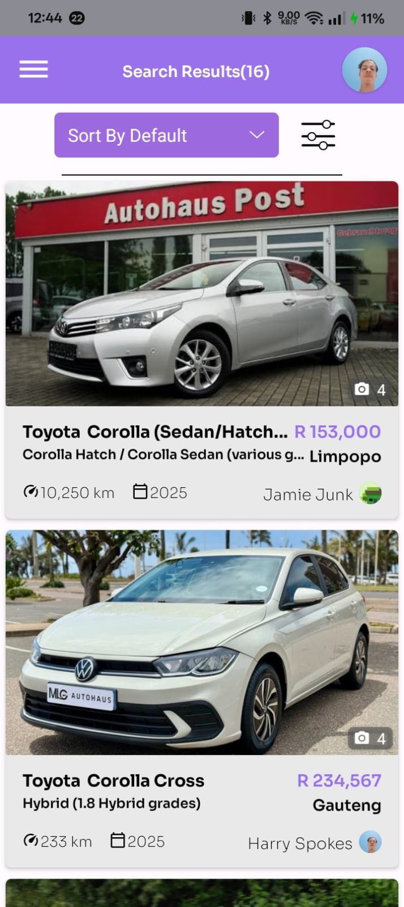
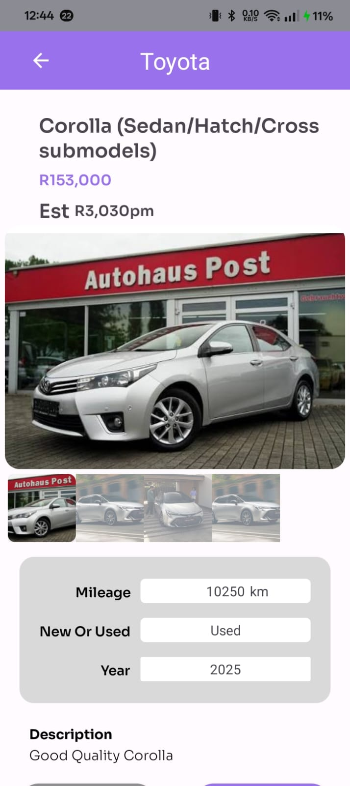
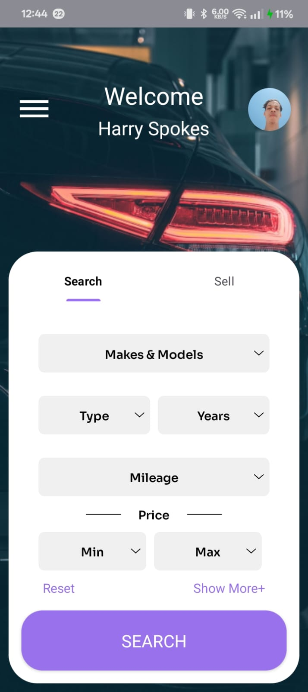
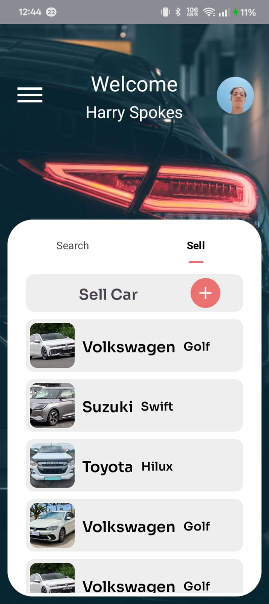

# AutoElite 🚗

AutoElite is an Android application built using Kotlin that allows users to browse, explore, and interact with a curated selection of vehicles. The application focuses on providing a smooth user experience with a clean interface and structured vehicle selection flow.

## 📱 Features

- Browse available vehicles
- Vehicle selection interface
- Clean and modern UI
- Structured navigation flow
- Optimized layouts and organized components
- Scalable architecture for future enhancements

## 🛠 Built With

- Kotlin
- Android SDK
- Gradle
- Android Studio  

## 🚀 Getting Started

### Prerequisites

- Android Studio (latest stable version recommended)
- Android SDK installed
- Gradle (wrapper included in project)

### Installation

1. Clone the repository
2. Open the project in Android Studio
3. Allow Gradle to sync
4. Run the application on an emulator or physical device

## 📌 Minimum Requirements

- Minimum SDK: 29
- Target SDK: 35

## 📸 Screenshots

### Browse Cars

### View Car Details

### Buy Car

### Sell Car

## 🧩 Future Improvements
- Performance optimizations
- -ui improvements

## 👤 Author

Jamie Theo Junk
